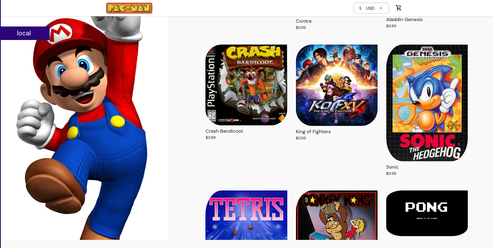

# Retro Station

**Retro Station** is a cloud-native microservices application that consists of a 10-tier microservices application. The application is a
web-based e-commerce app where users can browse retro games, add them to the cart, and purchase them.

## Screenshots

### Catalog

### Product

### Recommendations

### Checkout

### Shipping Confirmation

## Architecture

**Retro Station** is composed of 10 microservices that talk to each other over gRPC.

| Service                                              | Language      | Description                                                                                                                       |
| ---------------------------------------------------- | ------------- | --------------------------------------------------------------------------------------------------------------------------------- |
| [frontend](./src/frontend)                           | Go            | Exposes an HTTP server to serve the website. Does not require signup/login and generates session IDs for all users automatically. |
| [cartservice](./src/cartservice)                     | Go            | Stores the items in the user's shopping cart in Redis and retrieves it.                                                           |
| [productcatalogservice](./src/productcatalogservice) | Go            | Provides the list of products from a JSON file and ability to search products and get individual products.                        |
| [currencyservice](./src/currencyservice)             | Go            | Converts one money amount to another currency. Uses real values fetched from European Central Bank. It's the highest QPS service. |
| [paymentservice](./src/paymentservice)               | Go            | Charges the given credit card info (mock) with the given amount and returns a transaction ID.                                     |
| [shippingservice](./src/shippingservice)             | Go            | Gives shipping cost estimates based on the shopping cart. Ships items to the given address (mock)                                 |
| [emailservice](./src/emailservice)                   | Go            | Sends users an order confirmation email (mock).                                                                                   |
| [checkoutservice](./src/checkoutservice)             | Go            | Retrieves user cart, prepares order and orchestrates the payment, shipping and the email notification.                            |
| [recommendationservice](./src/recommendationservice) | Go            | Recommends other products based on what's given in the cart.                                                                      |
| [loadgenerator](./src/loadgenerator)                 | Python+Locust | Continuously sends requests imitating realistic user shopping flows to the frontend.                                              |

## Features

- **[Kubernetes](https://kubernetes.io):**
  The app is designed to run on Kubernetes.
- **[gRPC](https://grpc.io):** Microservices use a high volume of gRPC calls to
  communicate to each other.
- **[Istio](https://istio.io):** Application works on Istio service mesh.
- **[Skaffold](https://skaffold.dev):** Application
  is deployed to Kubernetes with a single command using Skaffold.
- **Synthetic Load Generation:** The application demo comes with a background
  job that creates realistic usage patterns on the website using
  [Locust](https://locust.io/) load generator.

## Local Development

See the [Development Guide](/docs/development-guide.md) on how to build this demo locally.
